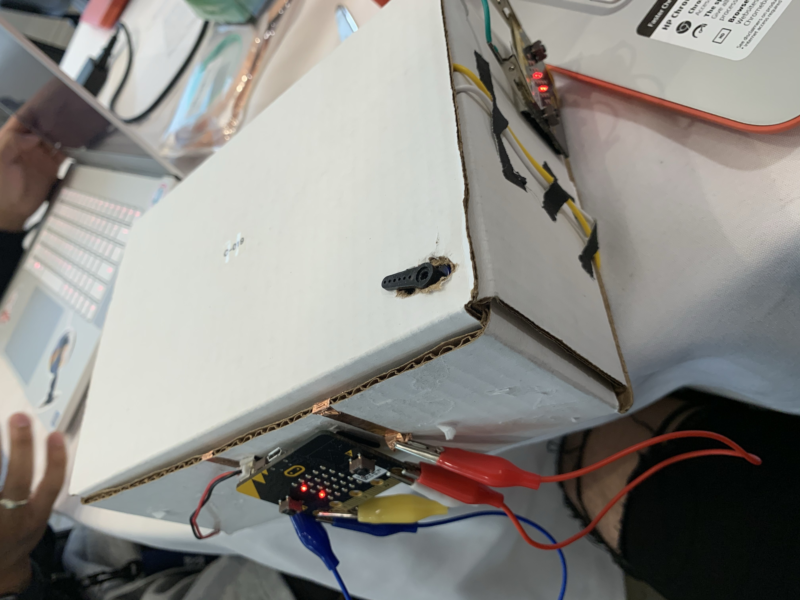
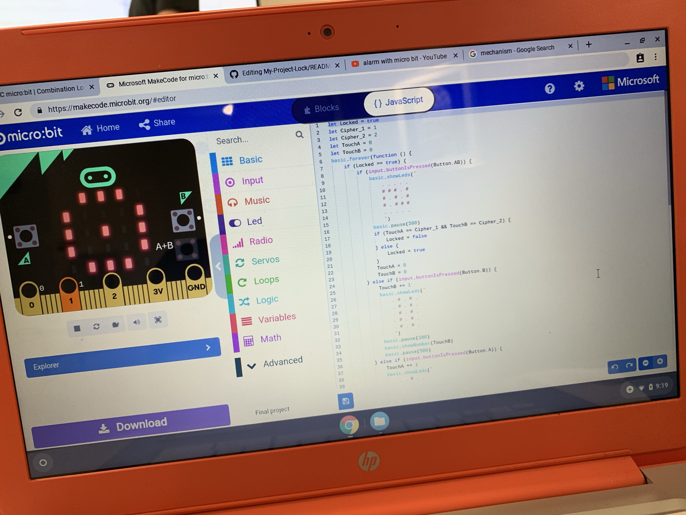

# SoarCS 2019!

<!-- Note, the line below this one is what links to your screenshot, **DO NOT REMOVE** -->

<!--
In this file, you should write a brief description of what your
project is, what you learned, and a simple screenshot of your work.

To add a screenshot, please replace `screenshot.png` with
your own screenshot.
-->

## Lock box
My partner and I were looking to make a safebo kind of. The end goal was to create a lock box that would set an alarm when 
it's open. It also inlcudes a servo that is used as a lock mechanism.
